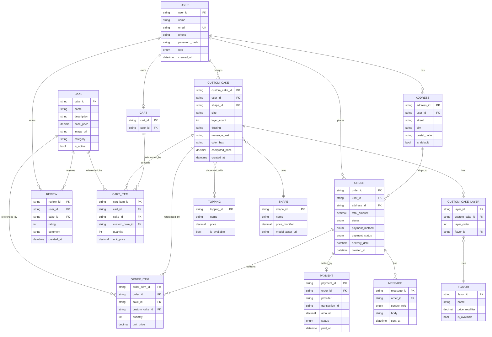

# Stage 2 — Entity-Relationship Model

The canonical schema is [`prisma/schema.prisma`](../prisma/schema.prisma) and the raw DDL is [`docs/schema.sql`](schema.sql). This document explains entities and relationships and provides a Mermaid diagram you can render into a PNG for the deliverable.

## Mermaid ER Diagram

## XOR Constraint on Items

`CART_ITEM` and `ORDER_ITEM` each reference **either** `CAKE` **or** `CUSTOM_CAKE`, never both, never neither. Enforced in two places:

1. **Database** — CHECK constraint:
   `((cake_id IS NOT NULL)::int + (custom_cake_id IS NOT NULL)::int) = 1`
2. **Application** — Zod schema validates the input shape at the API boundary.

## Cardinality Summary

| Relationship | Type |
|---|---|
| User – Address | 1 : N |
| User – Cart | 1 : 0..1 |
| User – Order | 1 : N |
| User – CustomCake | 1 : N |
| Cart – CartItem | 1 : N |
| Order – OrderItem | 1 : N |
| Order – Payment | 1 : 0..1 (only when `payment_method = online`) |
| Order – Message | 1 : N |
| CustomCake – CustomCakeLayer | 1 : N (1..5) |
| CustomCake – Topping | N : M (via `custom_cake_topping`) |
| CustomCake – Shape | N : 1 |
| CustomCakeLayer – Flavor | N : 1 |
| Cake – Review | 1 : N |

## How to Export the PNG
1. Open this file in VS Code with the Markdown Preview Mermaid Support extension, or
2. Paste the Mermaid block into <https://mermaid.live> and export as PNG to `docs/er-diagram.png`.
